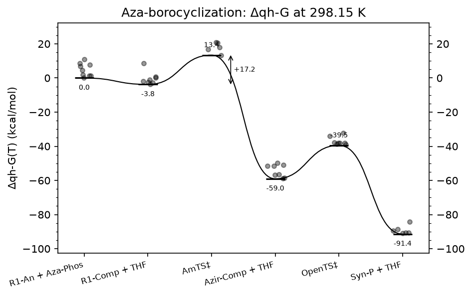
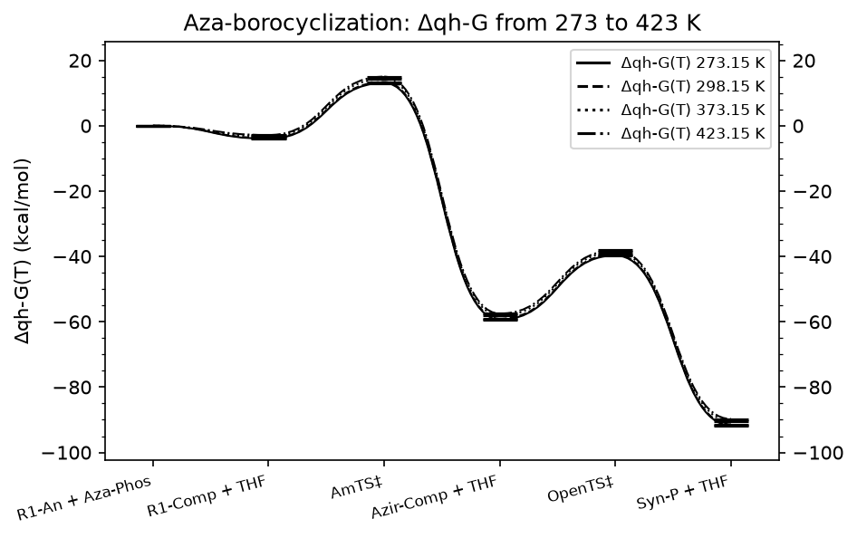
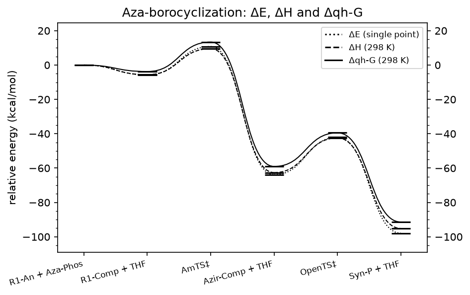
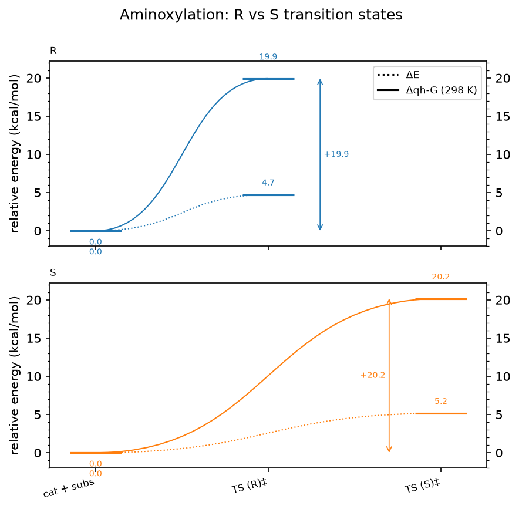
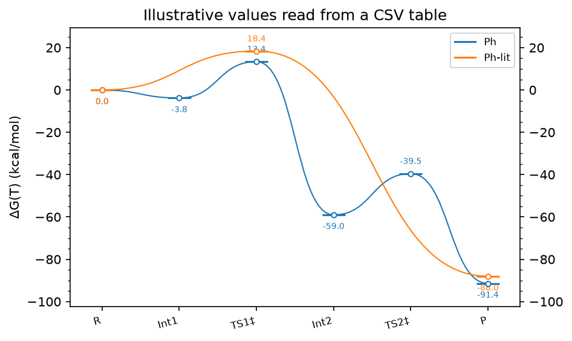
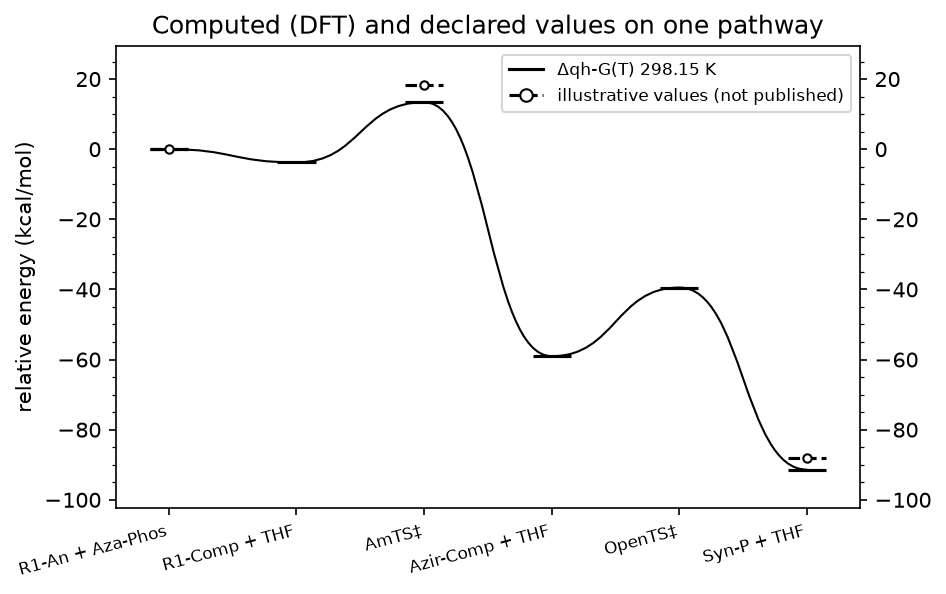

# Gallery

Reproducible reaction-profile figures. Each is rebuilt by
`python goodvibes/examples/gallery/build_gallery.py` from compact files in the
repository (reaction-profile documents with embedded conformers, and a CSV
table); no program output is needed. The inputs, the code of every figure and
the commands are in
[`goodvibes/examples/gallery`](https://github.com/patonlab/GoodVibes/tree/master/goodvibes/examples/gallery).

## Δqh-G with every conformer

One computed series at 298.15 K from about 100 Gaussian outputs, transition
states labelled above their bar, each conformer drawn around its species'
level, and a barrier annotation.

## One profile at four temperatures

The embedded structures re-evaluated at each temperature without the output
files: `goodvibes-profile plot azabor_profile.json --temperatures 273.15,298.15,373.15,423.15`.

## ΔE, ΔH and Δqh-G on one axes

Three quantities of the same structures as three series.

## Competing transition states, one panel each

Two pathways from one reactant pair (`layout: panels`), ΔE dotted and
Δqh-G solid, barriers marked.

## A CSV table of relative energies

`goodvibes-profile plot levels.csv`: a hand-typed table is a profile.
The values are illustrative, not from a publication.

## Computed and declared values together

A declared series (hollow markers; illustrative values) next to the computed
Δqh-G on the same points.
