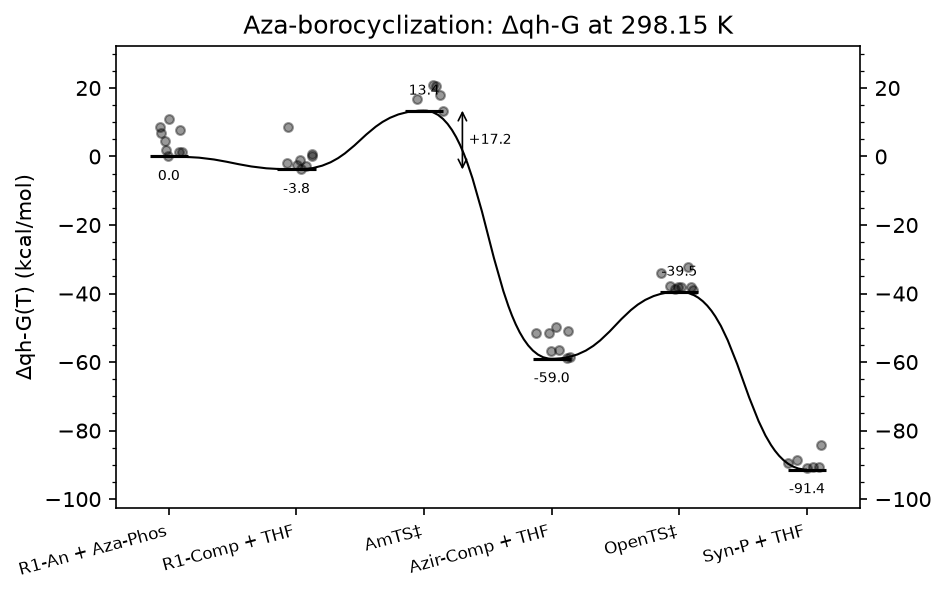
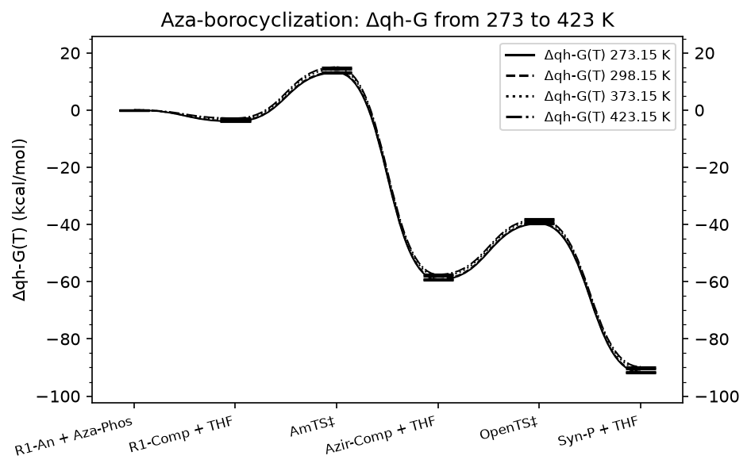
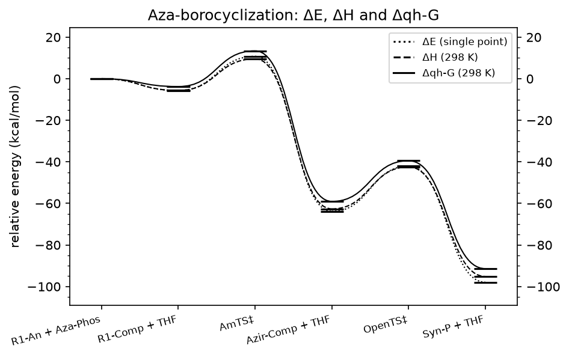
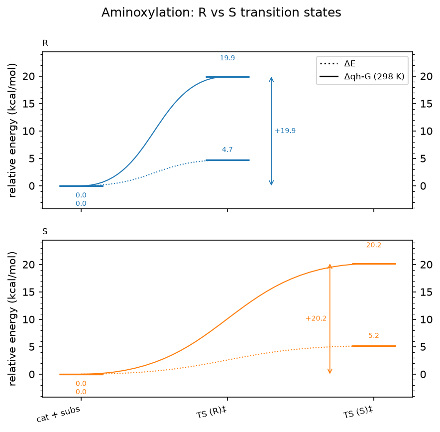
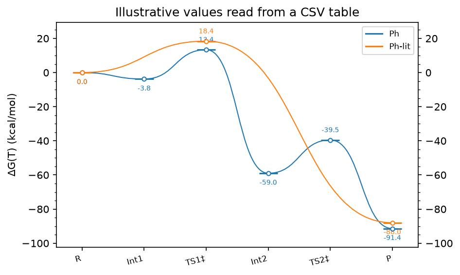
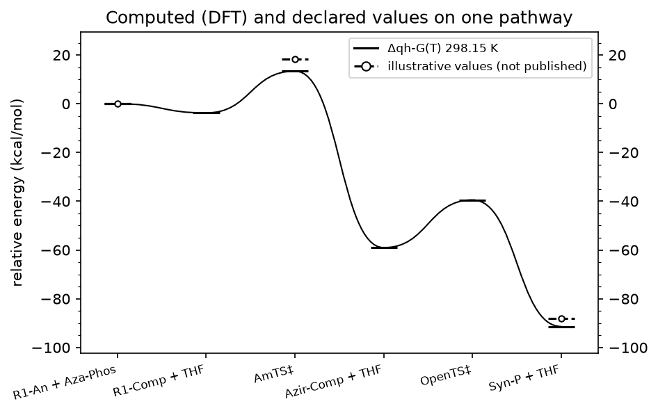
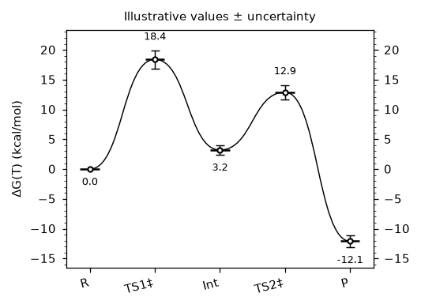

# Reaction-profile gallery

Every figure below is rebuilt from compact files committed in this repository;
no program output is read:

```bash
python goodvibes/examples/gallery/build_gallery.py        # writes docs/source/gallery/*.png
python goodvibes/examples/gallery/build_gallery.py --out figs --formats png,svg,pdf
```

| Input | What it is | Size |
| --- | --- | --- |
| `../profiles/azabor_profile.json` | aza-borocyclization profile from about 100 Gaussian outputs (`../pes`), with every structure's parsed data embedded (`--with-conformers`) | 380 KB |
| `aminox_profile.json` | aminoxylation R vs S transition states from the six outputs in `../gconf_ee_boltz`, with embedded conformers | 22 KB |
| `../profiles/levels.csv` | a table of relative energies; **illustrative values, not from a publication** | < 1 KB |
| `../profiles/minimal.yaml` | a five-point typed-in profile; **illustrative values** | < 1 KB |

`_generate_inputs.py` (and `../profiles/_generate.py`) regenerate the two
documents from the outputs; the gallery itself only needs the documents.
The code for each figure is a short function in `build_gallery.py`. The snippets
below run from the repository root.

## Δqh-G with every conformer



One computed series at 298.15 K, transition states labelled above their bar,
each conformer drawn at the level plus its offset from the species' ensemble
value, and the document's barrier annotation.

```python
prof = load_profile("goodvibes/examples/profiles/azabor_profile.json")
prof.plot(series=["qh_gibbs@298.15K"], label_points=True, show_conformers=True)
```

## One profile at four temperatures



The embedded structures are re-evaluated at each temperature, without the
output files; one linestyle per temperature.

```bash
goodvibes-profile plot goodvibes/examples/profiles/azabor_profile.json --temperatures 273.15,298.15,373.15,423.15 -o scan.png
```

## ΔE, ΔH and Δqh-G on one axes



Three computed series of different quantities from the same structures:
the single-point electronic energy, the enthalpy and the quasi-harmonic free
energy.

```python
prof.series = [Series(id="E", label="ΔE (single point)", quantity="spc", temperature=298.15,
                      style={"linestyle": ":"}),
               Series(id="H", label="ΔH (298 K)", quantity="enthalpy", temperature=298.15),
               Series(id="G", label="Δqh-G (298 K)", quantity="qh_gibbs", temperature=298.15)]
prof.evaluate().plot()
```

## Competing transition states, one panel each



Two pathways from one reactant pair (`layout: panels` in the document's
style), ΔE dotted and Δqh-G solid, with the free-energy barriers marked. The
catalyst is a three-conformer ensemble.

```bash
goodvibes-profile plot goodvibes/examples/gallery/aminox_profile.json -o branches.png
```

## A CSV table of relative energies



A table typed in by hand is a profile too; declared values are drawn with
hollow markers. The numbers in `levels.csv` are illustrative.

```bash
goodvibes-profile plot goodvibes/examples/profiles/levels.csv -o levels.png --quantity gibbs --temperature 298.15
```

## Computed and declared values together



A declared series (here the illustrative `Ph-lit` column of `levels.csv`)
drawn next to the computed Δqh-G on the same points, the way a literature
comparison or an MLIP-vs-DFT benchmark is shown.

```python
prof.series = [prof.get_series("qh_gibbs@298.15K"),
               Series.declared_from("illustrative", "illustrative values (not published)",
                                    {"Ph": {"R1-An + Aza-Phos": 0.0, "AmTS + THF": 18.4, "Syn-P + THF": -88.0}},
                                    quantity="gibbs", temperature=298.15)]
prof.plot()
```

## A journal-column preset with error bars



`minimal.yaml` with illustrative `uncertainty` values, drawn at the
`single-column` preset (about 85 mm wide, 7 pt text). Presets set the figure
size, fonts and line widths for that figure only; `double-column` and `slide`
are the others. Saved as SVG, the figure keeps its text editable and embeds
the drawn document (`goodvibes-profile table fig.svg` reads it back).

```python
prof = load_profile("goodvibes/examples/profiles/minimal.yaml")
prof.series[0].uncertainty = {"main": {"TS1": 1.5, "Int": 0.8, "TS2": 1.2, "P": 1.0}}
prof.plot(preset="single-column", label_points=True).save("fig.svg", "fig.pdf")
```

## Adding an example

Commit the compact input (a reaction-profile document, with `--with-conformers`
when it should be re-evaluable, a GoodVibes `--export` payload, `.extxyz`
files or a CSV), the script that made it, and a function in
`build_gallery.py`; archive the program outputs elsewhere (e.g. Zenodo) and
cite them here. `tests/test_gallery.py` rebuilds every figure and checks its
numbers; `tests/test_gallery_images.py` compares each figure's geometry with
a baseline image, so add one with
`GOODVIBES_UPDATE_BASELINES=1 pytest tests/test_gallery_images.py` (and look
at it before committing).
